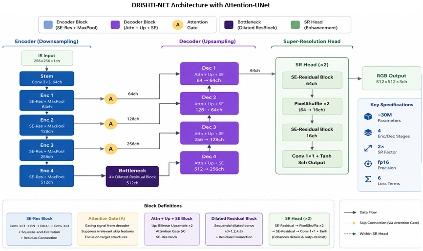
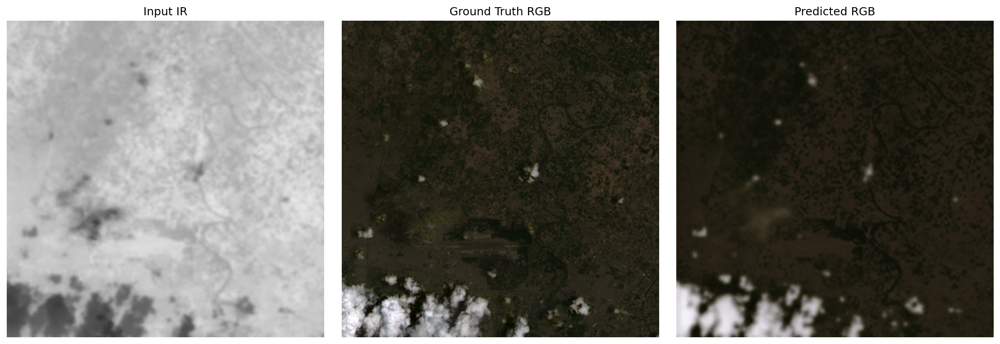

# DRISHTI-Net

**DRISHTI-Net** (दृष्टि — *vision*) is a deep learning framework for **Infrared to RGB Super-Resolution Colorization** using Landsat 9 satellite imagery. Given a 256×256 single-channel thermal infrared image, DRISHTI-Net produces a perceptually accurate 512×512 three-channel RGB image, simultaneously performing colorization and 2× spatial super-resolution.

---

## Network

DRISHTI-Net supports two operating modes selectable via training config:

### Mode 1 — Attention U-Net (baseline)


A residual encoder-decoder with attention-gated skip connections and a dilated bottleneck.

**Encoder** — Four downsampling stages, each consisting of a Squeeze-and-Excitation Residual Block followed by max-pooling. SE channel attention at each scale lets the encoder selectively amplify informative feature channels and suppress noise — important for thermal imagery which has low spatial contrast.

**Bottleneck** — Five stacked Dilated Residual Blocks with dilation schedule d = 1 → 2 → 4 → 2 → 1. The expanding receptive fields capture both local texture and broad spatial context simultaneously. SE attention is applied within each dilated block.

**Decoder** — Four upsampling stages mirroring the encoder. Before each skip connection is merged, an Attention Gate filters the encoder features using the decoder's gating signal, suppressing spatial regions irrelevant to the current scale. Each decoder block uses SE Residual convolutions.

**SR Head** — Replaces the standard 1×1 output convolution with a sub-pixel convolution (PixelShuffle ×2). The head first refines features with an SE Residual Block, expands channels by 4× with a 3×3 convolution, then uses PixelShuffle to rearrange them into a 2× higher-resolution feature map, followed by a second SE Residual refinement and a final 1×1 RGB projection with Tanh activation. This produces the 512×512 output with no bilinear blurriness or checkerboard artefacts.


```
Input  : (B,  1, 256, 256)  thermal IR
Output : (B,  3, 512, 512)  RGB colorization at 2× resolution
```

### Mode 2 — GAN U-Net

The Attention U-Net above acts as the **generator**. A conditional **70×70 PatchGAN discriminator** is trained alongside it.

The discriminator receives the concatenation of the IR input (upsampled to 512×512) and the generated or real RGB image, and outputs a grid of real/fake patch scores. Conditioning on the IR image forces the discriminator to judge whether the colourisation is contextually correct for the scene — not merely whether the output looks photorealistic in isolation. This is more effective than an unconditional discriminator for paired image translation.

Spectral normalisation is applied to every discriminator convolution for training stability. The adversarial loss uses Least-Squares GAN (LSGAN) rather than binary cross-entropy to prevent gradient saturation once the discriminator becomes confident.

The generator objective combines adversarial loss with the reconstruction loss below, weighted by `adv_weight` (recommended: 0.01 initially, rising to 0.05 after ~20 epochs).

---

## Performance Comparison

| Task | Method | PSNR (dB) | SSIM |
|------|--------|----------:|-----:|
| Satellite Super-Resolution (Landsat → Sentinel) | DTGAN (Remote Sensing, 2023[1]) | 31–35 | 0.91–0.96 |
| Satellite Image Colorization | Diffusion-based (Remote Sensing, 2024 [2]) | 28–30 | 0.90–0.93 |
| **DRISHTI-Net (Band 5 → RGB + 2× SR)** | **Attention U-Net (Proposed)** | **30.5** | **0.79** |
| **DRISHTI-Net++ (Band 5 → RGB + 2× SR)** | **Attention U-Net + PatchGAN + Feature Matching** | **30.7** | **0.802** |

---

## Loss Function

The default training loss is **CombinedLoss v3**, a stack of five complementary terms:

| Term | Weight | Purpose |
|---|---|---|
| Multi-Scale Edge Charbonnier | `grad_weight` | Edge-aware smooth-L1 at 3 spatial scales. Enforces sharpness at both fine and coarse levels. |
| FFT Frequency Loss | `freq_weight` | L1 on the 2D FFT magnitude spectrum. Penalises missing high-frequency detail equally across all frequencies — the primary driver of SR sharpness. |
| Lab Colour Loss | `color_weight` | L1 in CIE Lab space with 2× upweighted chrominance (a\*, b\*). Prevents the desaturation / grey-bias common in thermal→RGB networks. |
| SSIM Loss | `ssim_weight` | Structural similarity. Preserves perceived texture and contrast. |
| Smooth L1 | `l1_weight` | Pixel-level fidelity baseline. |

---


## Training

Install dependencies:

```bash
pip install torch torchvision pystac-client planetary-computer \
            pytorch-msssim lpips torchmetrics[image] rasterio tqdm pillow
```

**Attention U-Net:**

```bash
python train.py \
    --dataset   /path/to/dataset \
    --model_type attention_unet \
    --ir_size    256 \
    --rgb_size   512 \
    --epochs     200 \
    --batch_size 4 \
    --lr         2e-4 \
    --exp_run_name exp_attunet
```

**GAN U-Net:**

```bash
python train.py \
    --dataset    /path/to/dataset \
    --model_type gan_unet \
    --adv_weight 0.01 \
    --ir_size    256 \
    --rgb_size   512 \
    --epochs     200 \
    --batch_size 4 \
    --lr         2e-4 \
    --exp_run_name exp_gan
```

The scheduler is Cosine Annealing (T_max = epochs, η_min = 1e-6). Best weights are saved automatically when validation loss improves. For the GAN, only the generator weights are saved to `best_model.pth` so test and export scripts are model-type agnostic.

Resume training from a checkpoint:

```bash
python train.py ... --resume checkpoints/exp_gan/epoch_050.pth
```

---

## Evaluation

```bash
python test.py \
    --config  configs/baseline.yaml \
    --weights checkpoints/exp_gan/best_model.pth \
    --output  results/exp_gan
```

With FID (recommended with 200+ test images):

```bash
python test.py \
    --config      configs/baseline.yaml \
    --weights     checkpoints/exp_gan/best_model.pth \
    --output      results/exp_gan \
    --compute_fid
```

Reported metrics: PSNR (dB), SSIM, LPIPS (lower = better), FID (lower = better).

---

## ONNX Export

Exports the generator (or full model for attention_unet):

```bash
python onnx_export.py \
    --config  configs/baseline.yaml \
    --weights checkpoints/exp_gan/best_model.pth \
    --output  drishti_net.onnx
```

---

## References

\[1\] Wang, C.; Zhang, X.; Yang, W.; Wang, G.; Zhao, Z.; Liu, X.; Lu, B. Landsat-8 to Sentinel-2 Satellite Imagery Super-Resolution-Based Multiscale Dilated Transformer Generative Adversarial Networks. *Remote Sensing* **2023**, *15*(22), 5272. https://doi.org/10.3390/rs15225272

\[2\] Fu, Q.; Xia, S.; Kang, Y.; Sun, M.; Tan, K. Satellite Remote Sensing Grayscale Image Colorization Based on Denoising Generative Adversarial Network. *Remote Sensing* **2024**, *16*(19), 3644. https://doi.org/10.3390/rs16193644

---

## Authors

Nithya Athreya